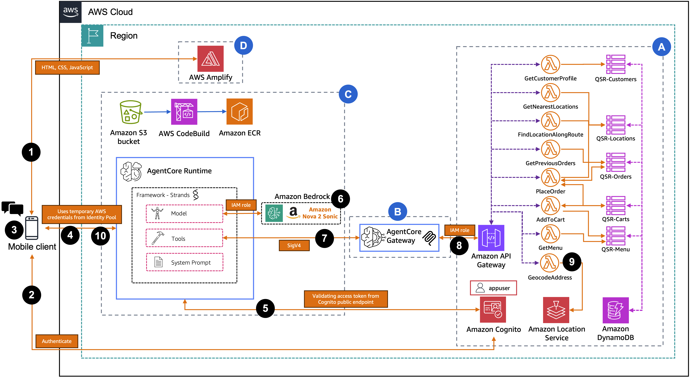

# Guidance for AI-Powered QSR Voice Ordering System on AWS

## Table of Contents
- 📋 [Solution Overview](#solution-overview)
- 🏛️ [Architecture Overview](#architecture-overview)
- ⚡ [Quick Start](#quick-start)
- 💰 [Cost](#cost)
- ✅ [Prerequisites](#prerequisites)
- 🚀 [Deployment Steps](#deployment-steps)
- 🔍 [Deployment Validation](#deployment-validation)
- 📘 [Running the Guidance](#running-the-guidance)
- 🧪 [Testing](#testing)
- 🔒 [Security Considerations](#security-considerations)
- 🚀 [Performance Optimization](#performance-optimization)
- ➡️ [Next Steps](#next-steps)
- 🧹 [Cleanup](#cleanup)
- ❓ [FAQ, Known Issues, Additional Considerations, and Limitations](#faq-known-issues-additional-considerations-and-limitations)
- 📝 [Revisions](#revisions)
- ⚠️ [Notices](#notices)
- 👥 [Authors](#authors)

## Solution Overview

This guidance demonstrates how to build an AI-powered voice ordering system for quick-service restaurants (QSR) that enables customers to place hands-free orders through natural voice conversation — no screens, no typing, no tapping. Whether on the go or multitasking, customers simply speak their order and the system handles the rest. The solution addresses the rapidly growing QSR voice ordering market, projected to reach **$1.32 billion by 2030**.

**What**: A production-ready voice ordering system using Amazon Bedrock AgentCore with Nova 2 Sonic for natural conversation, AWS Location Services for route optimization, and a four-section decoupled architecture.

**Who**: QSR businesses, restaurant chains, and developers building voice-first AI applications.

**Why**: Drive-thru lanes are a bottleneck — customers wait in line just to place an order, then wait again for pickup. Voice AI lets customers order ahead from their phone before they even reach the restaurant, turning the drive-thru into a pickup lane. For those already in line, it removes the wait at the menu board — order by voice from anywhere in the queue. The result: the bottleneck shifts from the lane to the kitchen, where it can be solved with workforce optimization rather than costly real estate expansion.

The solution leverages:
- [Amazon Bedrock AgentCore](https://aws.amazon.com/bedrock/agents/) for agent hosting and bidirectional streaming
- [Amazon Nova 2 Sonic](https://aws.amazon.com/bedrock/nova/) for speech-to-speech with async tool calling
- [Strands Agents](https://strandsagents.com/) framework for building the conversational agent
- [AWS Location Services](https://aws.amazon.com/location/) for geocoding and route optimization
- [Model Context Protocol (MCP)](https://modelcontextprotocol.io/) for standardized tool interactions
- [AWS CDK](https://aws.amazon.com/cdk/) for infrastructure as code

### Demo

[Demo video placeholder - voice ordering conversation with interruptions and location-based recommendations]

## Architecture Overview

The architecture implements a production-ready pattern for voice-first AI ordering systems with four decoupled sections:



### Section A — Backend Infrastructure

Five CDK stacks deployed in dependency order:

- **QSR-DynamoDBStack** — Five tables: customer profiles, orders, menu items, carts, and locations
- **QSR-LocationStack** — AWS Location Services for geocoding, route calculation, and map rendering
- **QSR-LambdaStack** — Eight Lambda functions for customer lookups, order management, menu retrieval, cart operations, and location search, each with scoped IAM roles
- **QSR-ApiGatewayStack** — REST API fronting the Lambda functions with IAM authorization
- **QSR-CognitoStack** — User Pool, Identity Pool, authenticated IAM role (with API, AgentCore, and Location permissions), and an initial test user

### Section B — AgentCore Gateway

A CDK stack with a Node.js Custom Resource that calls the Bedrock AgentCore control plane APIs to create:

- An IAM service role for the gateway
- An AgentCore Gateway (`qsr-ordering-gateway`) with MCP protocol
- A Gateway Target (`qsr-backend-api`) pointing to the API Gateway from Section A, exposing all eight endpoints as discoverable MCP tools

### Section C — AgentCore Runtime

Two CDK stacks:

- **AgentCoreInfraStack** — ECR repository, S3 source bucket, CodeBuild project (ARM64 Docker builds), and IAM roles for CodeBuild and the runtime
- **AgentCoreRuntimeStack** — Uploads agent source to S3, triggers a CodeBuild Docker build, waits for completion, then creates an AgentCore Runtime (`qsr_ordering_agent_runtime`) with WebSocket protocol and the Gateway URL from Section B

The agent is built with the [Strands Agents](https://strandsagents.com/) framework and uses Amazon Nova 2 Sonic for bidirectional voice streaming.

### Section D — Frontend (AWS Amplify)

A CDK stack creates an AWS Amplify App for hosting the React frontend. After the stack deploys, the frontend code is built and pushed to Amplify via CLI.

### User Request Flow

1. User opens the web app on Amplify and authenticates with Cognito (username + password → JWT tokens)
2. Frontend exchanges the ID Token with the Identity Pool for temporary AWS credentials
3. Frontend opens a SigV4-signed WebSocket to AgentCore Runtime and sends the Access Token for identity verification
4. Runtime validates the token via Cognito GetUser API and extracts the customer's name, email, and customerId
5. Runtime initializes Nova 2 Sonic on Bedrock with a personalized system prompt
6. Runtime connects to AgentCore Gateway as an MCP client (SigV4) and discovers available tools
7. User speaks their order — the agent processes voice through Nova 2 Sonic and invokes tools asynchronously via MCP

## Quick Start

```bash
# 1. Validate prerequisites
./preflight-check.sh

# 2. Deploy everything (IMPORTANT: Use a VALID email address)
./deploy-all.sh --user-email your-valid-email@example.com --user-name "Your Name"

# 3. Check status
./status.sh

# 4. Test the system
cd backend/agentcore-runtime/test-client
python3 client-cognito-sigv4.py --username AppUser --password <your-password>

# 5. Cleanup when done
./cleanup-all.sh
```

> **⚠️ IMPORTANT**: You **must** use a **valid email address** that you can access. AWS Cognito will send a temporary password to this email address, which is required for first-time login. Check your inbox and spam folder for the password email.

## Cost

You are responsible for the cost of the AWS services used while running this Guidance.

We recommend creating a [Budget](https://console.aws.amazon.com/billing/home#/budgets) through [AWS Cost Explorer](https://aws.amazon.com/aws-cost-management/aws-cost-explorer/) to help manage costs. Prices are subject to change. For full details, refer to the pricing webpage for each AWS service used in this Guidance.

### Sample Cost Table

The following estimates assume 1,000 voice orders per month with 5 restaurant locations in US East (N. Virginia). Estimates are based on observed token usage from real agent interactions and do not account for AWS Free Tier.

| AWS Service | Dimensions | Monthly Cost |
|-------------|------------|-------------|
| [Amazon Bedrock (Nova 2 Sonic)](https://aws.amazon.com/nova/pricing/) | ~680 input + ~5,083 output speech tokens/session, ~7,438 input + ~1,260 output text tokens/session | $68.96 |
| [Amazon Bedrock AgentCore Runtime](https://aws.amazon.com/bedrock/agentcore/pricing/) | 1,000 sessions, ~5 min each, ~30% active CPU, 1 vCPU, 512MB memory | $2.63 |
| [Amazon Bedrock AgentCore Gateway](https://aws.amazon.com/bedrock/agentcore/pricing/) | 1,000 search calls + 29,000 tool invocations, 8 tools indexed | $0.17 |
| [Amazon Cognito](https://aws.amazon.com/cognito/pricing/) | 1,000 MAUs at $0.0055/MAU | $5.50 |
| [AWS Lambda](https://aws.amazon.com/lambda/pricing/) | 29,000 invocations, 512MB, ~1s avg duration | $0.25 |
| [Amazon API Gateway](https://aws.amazon.com/api-gateway/pricing/) | 29,000 REST API calls | $0.10 |
| [Amazon DynamoDB](https://aws.amazon.com/dynamodb/pricing/) | 5 tables, on-demand, ~29K reads + ~5K writes | $0.01 |
| [AWS Location Services](https://aws.amazon.com/location/pricing/) | ~1,000 geocoding + ~500 route calculations | $0.50 |
| [AWS Amplify](https://aws.amazon.com/amplify/pricing/) | Hosting: 5GB storage, 15GB bandwidth | $0.50 |
| | **Estimated Total** | **~$78.62** |

**Notes**:
- Costs do not include AWS Free Tier benefits. Actual costs may be lower if your account qualifies.
- Nova 2 Sonic output speech tokens are the dominant cost driver (~88% of total).
- Token counts are based on observed metrics from real ordering conversations with tool calls.
- AgentCore Runtime uses consumption-based pricing — you pay only for active CPU and memory, not I/O wait time.
- Costs scale linearly with usage. For 10,000 orders/month, estimated cost is ~$786.

## Prerequisites

**Development Tools**
- Node.js 20.x or later
- Python 3.12 or later
- AWS CLI configured with credentials
- AWS CDK CLI: `npm install -g aws-cdk`

**AWS Account Requirements**
- Access to the following services:
  - Amazon Bedrock AgentCore Runtime
  - Amazon Bedrock (Nova 2 Sonic model access)
  - AWS Lambda
  - Amazon DynamoDB
  - AWS Location Services
  - Amazon Cognito
  - AWS Amplify
  - Amazon API Gateway

- [AWS Identity and Access Management (IAM)](https://aws.amazon.com/iam/) permissions to:
  - Deploy CDK stacks and CloudFormation templates
  - Create and manage Bedrock AgentCore Runtimes and Gateways
  - Configure Cognito User Pools and Identity Pools
  - Create Lambda functions and API Gateway endpoints
  - Set up DynamoDB tables and Location Services resources

**Important**: Ensure your AWS account has Amazon Bedrock model access for Nova 2 Sonic. Request access through the [Amazon Bedrock console](https://console.aws.amazon.com/bedrock/) if needed.

## Deployment Steps

**Objective**: Deploy all components of the QSR ordering system in the correct order.

### Recommended: Idempotent Deployment

```bash
# 1. Validate prerequisites
./preflight-check.sh

# 2. Deploy (safe to run multiple times)
./deploy-all.sh --user-email your-email@example.com --user-name "Your Name"

# 3. Check status
./status.sh
```

**Key Features:**
- **Idempotent** - Run multiple times safely, updates existing resources
- **State tracking** - Automatically tracks what's deployed in `.deployment-state.json`
- **Preflight checks** - Validates Node.js, Python, AWS CLI, credentials, Bedrock access
- **Smart updates** - Skips healthy components, only deploys what's needed
- **Two modes**: `--mode update` (default, idempotent) or `--mode fresh` (clean redeploy)

**Preflight checks validate:**
- Node.js 20.x+, Python 3.12+, AWS CLI, CDK CLI
- AWS credentials and Bedrock Nova 2 Sonic access

### Alternative: One-Command Deployment

```bash
# Deploy all components at once
./deploy-all.sh --user-email your-email@example.com --user-name "Your Name"
```

**Required Parameters**:
- `--user-email`: **Your VALID email address** (AWS Cognito will send temporary password here - **you must have access to this email**)
- `--user-name`: Your full name (for the test user profile)

> **⚠️ CRITICAL**: The `--user-email` parameter must be a **valid, accessible email address**. AWS Cognito sends a temporary password to this email during deployment. If you don't receive the email within 5 minutes, check your spam/junk folder. Without this password, you cannot complete the deployment validation or testing.

The script will:
1. Deploy Backend Infrastructure (DynamoDB, Lambda, API Gateway, Cognito)
2. Create test user "AppUser" and send temporary password to your email
3. Deploy AgentCore Gateway (MCP server)
4. Deploy AgentCore Runtime (Agent with Nova 2 Sonic)
5. Display deployment outputs for configuration

**Success Criteria**: All stacks deploy successfully and outputs are saved to `cdk-outputs/` directory.

### Manual Deployment (Optional)

For step-by-step deployment of individual components, refer to each component's README:

**Deployment Order**:
1. [Backend Infrastructure](backend/backend-infrastructure/README.md) - DynamoDB, Lambda, API Gateway, Cognito
2. [AgentCore Gateway](backend/agentcore-gateway/README.md) - MCP server for tool exposure
3. [AgentCore Runtime](backend/agentcore-runtime/README.md) - Agent with Nova 2 Sonic
4. [Synthetic Data](backend/synthetic-data/README.md) - Sample data population (optional)

**Important - Test User Setup**: 
- The deployment script requires `--user-email` and `--user-name` parameters
- AWS Cognito creates a test user "AppUser" and sends a temporary password to your email
- Check your email (including spam folder) for the password
- The first login will prompt you to change the temporary password

## Deployment Validation

**Objective**: Verify that all components are working correctly together.

### 1. Verify Backend Infrastructure

```bash
# Check API Gateway endpoints
cd backend/backend-infrastructure
./test-api.sh -u AppUser -p <your-password>
```

**Expected Output**: All 8 API endpoints return successful responses.

### 2. Verify AgentCore Gateway

```bash
# List available MCP tools
cd backend/agentcore-gateway/test-client
python test_gateway.py --test list-tools
```

**Expected Output**: 8 tools listed (GetCustomerProfile, GetMenu, AddToCart, etc.)

### 3. Verify AgentCore Runtime

```bash
# Test voice conversation
cd backend/agentcore-runtime/test-client
python client-cognito-sigv4.py --username AppUser --password <your-password>
```

**Expected Output**: Web UI opens at http://localhost:8000 with working voice and text chat.

### 4. Populate Sample Data

```bash
# Generate realistic test data
cd backend/synthetic-data
python populate_data.py
```

**Expected Output**: Sample locations, menu items, and orders created in DynamoDB.

**Success Criteria**:
- All API endpoints respond correctly
- AgentCore Gateway exposes 8 MCP tools
- Voice conversation works in test client
- Sample data is populated in DynamoDB

If any validation step fails, refer to the [Troubleshooting](#troubleshooting) section.

## Running the Guidance

**Objective**: Use the deployed system to place voice orders.

### Using the Test Client

1. Start the test client:
```bash
cd backend/agentcore-runtime/test-client
python client-cognito-sigv4.py --username AppUser --password <your-password>
```

2. Open http://localhost:8000 in your browser

3. Click the microphone button and speak your order:
   - "Hello, I would like to place an order"
   - "I want a chicken sandwich combo"
   - "Find restaurants near me"

4. Observe the agent's voice response and order confirmation

### Expected Output

- **Voice Transcription**: Your speech is transcribed and displayed in the chat
- **Agent Response**: Natural voice response with order details
- **Tool Invocations**: Backend tools are called asynchronously (GetMenu, AddToCart, etc.)
- **Order Confirmation**: Order ID, total, and estimated ready time

### Example Conversation

```
User: Hello, I would like to place an order.

Agent: Hi Sergio, sure thing! Would you like to place an order at a 
       location near you, or are you looking for a specific location?

User: I would like to pick up at the place I usually go.

Agent: [Calling tools in background: GetPreviousOrders, GetMenu]
       
       Sure thing! While I'm getting the menu from your usual location,
       is there anything specific you'd like to order?

User: Yes, I want a Chicken Sandwich combo.

Agent: Alright! I see you previously ordered a Chicken Sandwich combo
       for $6.99 at Van Alstyne, Texas. Would you like to repeat that?

User: Yes.

Agent: Perfect! Your order is ready for pickup at Van Alstyne. 
       Total: $7.79. Estimated ready time: 15 minutes.
```

### Debugging and Logging

- **Frontend Logs**: Browser console (F12) shows WebSocket events and errors
- **Agent Logs**: CloudWatch Logs at `/aws/bedrock-agentcore/runtimes/<runtime-name>`
- **Lambda Logs**: CloudWatch Logs at `/aws/lambda/<function-name>`
- **API Gateway Logs**: CloudWatch Logs at `/aws/apigateway/<api-id>`

## Testing

Each component has its own test client with detailed instructions:

### Backend API Testing
Test REST API endpoints with Cognito authentication and SigV4 signing.
- See [backend/backend-infrastructure/README.md#testing](backend/backend-infrastructure/README.md#testing)
- Uses `test-api.sh` script to test all 8 endpoints

### AgentCore Gateway Testing
Test MCP tool exposure and connectivity.
- See [backend/agentcore-gateway/README.md#testing](backend/agentcore-gateway/README.md#testing)
- Uses `test_gateway.py` to list tools and invoke them

### AgentCore Runtime Testing
Test voice and text conversations with the agent.
- See [backend/agentcore-runtime/README.md#testing](backend/agentcore-runtime/README.md#testing)
- Uses `client-cognito-sigv4.py` with web UI at http://localhost:8000

## Security Considerations

This solution implements several security best practices:

1. **Authentication**: Amazon Cognito User Pool with email/password authentication
2. **Authorization**: AWS IAM with SigV4 signing for all API requests
3. **Temporary Credentials**: Cognito Identity Pool provides short-lived AWS credentials
4. **JWT Verification**: Access Token verification via Cognito GetUser API
5. **Encryption**: TLS 1.2+ for all connections, DynamoDB encryption at rest
6. **Session Isolation**: AgentCore microVMs provide per-user session isolation
7. **Least Privilege**: IAM roles with minimal required permissions

**Additional Security Recommendations**:
- Enable Multi-Factor Authentication (MFA) in Cognito User Pool
- Implement rate limiting for production deployments
- Enable AWS WAF for API Gateway protection
- Use AWS Secrets Manager for sensitive configuration
- Enable CloudTrail for audit logging

## Performance Optimization

To optimize the performance of your deployment:

### Voice Latency
- **Design goal**: Low latency for real-time speech-to-speech conversations ([Nova 2 Sonic Service Card](https://docs.aws.amazon.com/ai/responsible-ai/nova-2-sonic/overview.html))
- **Optimization**: Use async tool calling to avoid blocking conversation
- **Monitoring**: Track latency metrics in CloudWatch

### Database Performance
- **DynamoDB**: Single-digit millisecond latency with on-demand capacity
- **Optimization**: Use efficient key design for common access patterns
- **Monitoring**: Track consumed capacity and throttling events

### Location Services
- **Typical Latency**: 100-500ms for geocoding and route calculations
- **Optimization**: Cache frequently accessed routes
- **Monitoring**: Track API call duration and error rates

### Scalability
- **Concurrent Users**: AgentCore Runtime auto-scales to thousands of sessions
- **Lambda**: Concurrent execution limit (default 1000, can increase)
- **DynamoDB**: On-demand capacity mode for automatic scaling

### Cost Optimization
- Use on-demand pricing for variable traffic patterns
- Implement session timeouts to reduce idle costs
- Monitor usage with CloudWatch and Cost Explorer

## Next Steps

After deploying the guidance, consider these enhancements:

### Frontend Development
- Build React web application for production use
- Implement mobile app with React Native
- Add payment integration (Stripe, Square)
- Implement real-time order status updates

### Feature Enhancements
- Multi-language support with Nova 2 Sonic
- Dietary filters and allergen warnings
- Loyalty rewards and point redemption
- Delivery tracking integration
- POS system integration

### Production Readiness
- Set up CI/CD pipeline with AWS CodePipeline
- Implement comprehensive monitoring and alerting
- Add A/B testing for conversation flows
- Configure auto-scaling policies
- Set up disaster recovery procedures

### Analytics and Insights
- Build analytics dashboard for order trends
- Track popular items and peak hours
- Monitor conversation quality metrics
- Analyze customer satisfaction scores

## Cleanup

**Objective**: Remove all resources created by this guidance to avoid ongoing charges.

```bash
# Preview what will be deleted
./cleanup-all.sh --dry-run

# Delete all resources
./cleanup-all.sh
```

**Enhanced cleanup features:**
- **Idempotent** - Safe to run even if resources don't exist
- **Dry-run mode** - Preview deletions with `--dry-run`
- **Force mode** - Skip confirmations with `--force`
- Automatically removes deployment state

### Manual Cleanup (Optional)

```bash
# Remove all deployed resources
./cleanup-all.sh
```

The script will destroy resources in reverse order:
1. AgentCore Runtime
2. AgentCore Gateway
3. Backend Infrastructure

### Manual Cleanup (Optional)

If you prefer to remove components individually:

```bash
# 1. Delete AgentCore Runtime
cd backend/agentcore-runtime/cdk
cdk destroy --all

# 2. Delete AgentCore Gateway
cd backend/agentcore-gateway/cdk
cdk destroy --force

# 3. Delete Backend Infrastructure
cd backend/backend-infrastructure
cdk destroy --all
```

### Verify Cleanup

Check the AWS Console to ensure all resources are removed:
- CloudFormation stacks deleted
- Lambda functions removed
- DynamoDB tables deleted
- Cognito User Pool and Identity Pool removed
- AgentCore Runtime and Gateway deleted

**Success Criteria**: All resources are successfully removed and no longer incurring charges.

## FAQ, Known Issues, Additional Considerations, and Limitations

### Known Issues

- **Browser Compatibility**: Some browsers may block microphone access over non-HTTPS connections
- **Token Expiration**: Cognito tokens expire after 1 hour; users must re-authenticate
- **Cold Starts**: First Lambda invocation may take 2-3 seconds (subsequent calls are faster)

### Troubleshooting

#### Authentication Issues
- **Problem**: "Incorrect username or password"
- **Solution**: Use the temporary password sent to your email on first login. Change password when prompted.

#### WebSocket Connection Fails
- **Problem**: "Failed to connect to AgentCore Runtime"
- **Solution**: Verify WebSocket URL is correct and credentials are valid. Check CloudWatch Logs for errors.

#### Agent Not Responding
- **Problem**: Agent doesn't respond to voice input
- **Solution**: Verify microphone permissions in browser. Check that Nova 2 Sonic model access is enabled.

#### Tool Invocation Errors
- **Problem**: "Tool invocation failed"
- **Solution**: Verify AgentCore Gateway is deployed and API Gateway endpoints are accessible. Check Lambda function logs.

#### Deployment Failures
- **Problem**: CDK deployment fails
- **Solution**: Check AWS credentials are configured. Verify IAM permissions. Review CloudFormation stack events for errors.

### Additional Considerations

- **Bedrock Pricing**: Nova 2 Sonic charges per token (input and output)
- **Rate Limiting**: Consider implementing rate limiting for production deployments
- **Data Retention**: Configure DynamoDB TTL for automatic data cleanup
- **Compliance**: Ensure voice recordings comply with local regulations (GDPR, CCPA, etc.)
- **Accessibility**: Test with screen readers and keyboard navigation

### Limitations

- **Voice Quality**: Requires stable internet connection for real-time streaming
- **Language Support**: Currently supports English only (Nova 2 Sonic supports multiple languages)
- **Concurrent Sessions**: Limited by AgentCore Runtime capacity (can be increased)
- **Location Services**: Accuracy depends on GPS signal quality and address data

For issues or feature requests, please use the [GitHub Issues tab](https://github.com/aws-samples/qsr-voice-ordering-agentcore/issues).

## Revisions

- **v1.0.0** – Initial release with AgentCore Runtime, Nova 2 Sonic, and MCP integration

## Notices

Customers are responsible for making their own independent assessment of the information in this Guidance.

This Guidance:
(a) is for informational purposes only,
(b) represents AWS current product offerings and practices, which are subject to change without notice, and
(c) does not create any commitments or assurances from AWS and its affiliates, suppliers, or licensors.

AWS products or services are provided "as is" without warranties, representations, or conditions of any kind, whether express or implied.

AWS responsibilities and liabilities to its customers are controlled by AWS agreements, and this Guidance is not part of, nor does it modify, any agreement between AWS and its customers.

## Authors

- Sergio Barraza
- Salman Ahmed
- Ravi Kumar
- Ankush Goyal
