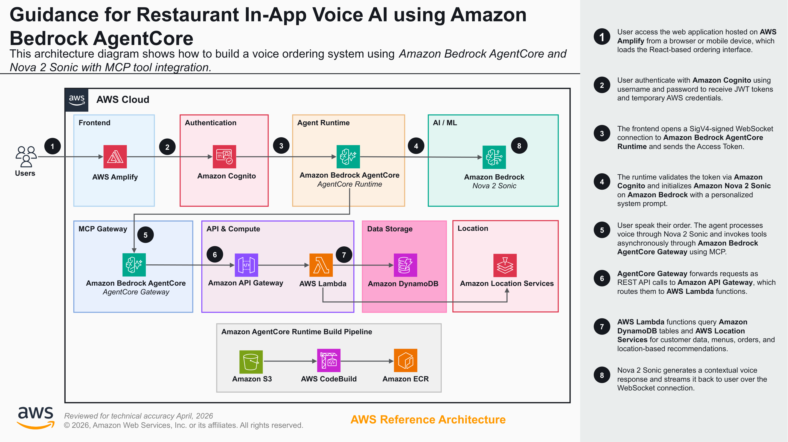

# Guidance for Restaurant In-App Voice AI using Amazon Bedrock AgentCore

## Table of Contents

1. [Overview](#overview)
    - [User request flow](#user-request-flow)
    - [Cost](#cost)
    - [Sample Cost Table](#sample-cost-table)
2. [Prerequisites](#prerequisites)
    - [Operating System](#operating-system)
    - [Third-party tools](#third-party-tools)
    - [AWS account requirements](#aws-account-requirements)
    - [AWS CDK bootstrap](#aws-cdk-bootstrap)
    - [Supported Regions](#supported-regions)
3. [Automated Deployment](#automated-deployment)
4. [Manual Deployment](#manual-deployment)
5. [Deployment Validation](#deployment-validation)
6. [Running the Guidance](#running-the-guidance)
7. [Next Steps](#next-steps)
8. [Cleanup](#cleanup)
9. [Notices](#notices)
10. [FAQ, Known Issues, Additional Considerations, and Limitations](#faq-known-issues-additional-considerations-and-limitations)
11. [Revisions](#revisions)
12. [Authors](#authors)

## Overview

This Guidance demonstrates how to build an AI-powered voice ordering system for quick-service restaurants (QSR) that enables customers to place hands-free orders through natural voice conversation. Customers speak their order and the system handles the rest — no screens, no typing, no tapping. The Guidance addresses the rapidly growing QSR voice ordering market by combining real-time speech-to-speech AI with a decoupled, scalable backend architecture.

The Guidance uses **Amazon Bedrock AgentCore** for agent hosting with microVM session isolation, **Amazon Nova 2 Sonic** for bidirectional speech-to-speech processing, the **Strands Agents** framework for conversational agent logic, **AWS Location Services** for geocoding and route optimization, and **Model Context Protocol (MCP)** for standardized tool interactions between the agent and backend services. All infrastructure is deployed using **AWS Cloud Development Kit (AWS CDK)**.

The architecture implements a four-section decoupled pattern:



**Section A — Backend Infrastructure.** Five CDK stacks deploy the restaurant backend: **Amazon DynamoDB** tables for customer profiles, orders, menu items, carts, and locations; **AWS Location Services** for geocoding, route calculation, and map rendering; **AWS Lambda** functions for business logic; **Amazon API Gateway** REST endpoints with **AWS Identity and Access Management (IAM)** authorization; and **Amazon Cognito** for user authentication with User Pool, Identity Pool, and an initial test user.

**Section B — AgentCore Gateway.** A CDK stack creates the **Amazon Bedrock AgentCore Gateway** with MCP protocol, exposing all eight backend API endpoints as discoverable MCP tools that the agent can invoke by name.

**Section C — AgentCore Runtime.** Two CDK stacks provision **Amazon Elastic Container Registry (Amazon ECR)** for container storage, **Amazon Simple Storage Service (Amazon S3)** for source uploads, **AWS CodeBuild** for ARM64 Docker builds, and the **Amazon Bedrock AgentCore Runtime** with WebSocket protocol. The agent uses the Strands Agents framework with Amazon Nova 2 Sonic for bidirectional voice streaming.

**Section D — Frontend.** A CDK stack creates an **AWS Amplify** application for hosting the React frontend. After the stack deploys, the frontend code is built and pushed to Amplify.

### User request flow

1. The user opens the web application hosted on **AWS Amplify** and authenticates with **Amazon Cognito** using username and password to receive JSON Web Token (JWT) tokens.
2. The frontend exchanges the ID Token with the **Amazon Cognito** Identity Pool for temporary AWS credentials.
3. The frontend opens a SigV4-signed WebSocket connection to **Amazon Bedrock AgentCore Runtime** and sends the Access Token for identity verification.
4. The runtime validates the token via the **Amazon Cognito** GetUser API and extracts the customer's name, email, and customer ID.
5. The runtime initializes **Amazon Nova 2 Sonic** on **Amazon Bedrock** with a personalized system prompt.
6. The runtime connects to **Amazon Bedrock AgentCore Gateway** as an MCP client using SigV4 authentication and discovers available tools.
7. The user speaks their order. The agent processes voice through Amazon Nova 2 Sonic and invokes tools asynchronously through the AgentCore Gateway using MCP. The gateway forwards requests as REST API calls to **Amazon API Gateway**, which routes them to **AWS Lambda** functions. Lambda functions query **Amazon DynamoDB** tables and **AWS Location Services**.
8. Amazon Nova 2 Sonic generates a contextual voice response incorporating the tool results and streams it back to the user over the WebSocket connection.

### Cost

You are responsible for the cost of the AWS services used while running this Guidance. As of April 2026, the cost for running this Guidance with the default settings in the US East (N. Virginia) Region is approximately $78.62 per month for processing 1,000 voice orders across 5 restaurant locations.

We recommend creating a [Budget](https://docs.aws.amazon.com/cost-management/latest/userguide/budgets-managing-costs.html) through [AWS Cost Explorer](https://aws.amazon.com/aws-cost-management/aws-cost-explorer/) to help manage costs. Prices are subject to change. For full details, refer to the pricing webpage for each AWS service used in this Guidance.

### Sample Cost Table

The following table provides a sample cost breakdown for deploying this Guidance with the default parameters in the US East (N. Virginia) Region for one month. Estimates assume 1,000 voice orders per month with 5 restaurant locations and do not account for AWS Free Tier benefits.

| AWS service | Dimensions | Cost [USD] |
| ----------- | ---------- | ---------- |
| [Amazon Bedrock (Nova 2 Sonic)](https://aws.amazon.com/nova/pricing/) | ~680 input + ~5,083 output speech tokens/session, ~7,438 input + ~1,260 output text tokens/session | $68.96 |
| [Amazon Bedrock AgentCore Runtime](https://aws.amazon.com/bedrock/agentcore/pricing/) | 1,000 sessions, ~5 min each, ~30% active CPU, 1 vCPU, 512 MB memory | $2.63 |
| [Amazon Bedrock AgentCore Gateway](https://aws.amazon.com/bedrock/agentcore/pricing/) | 1,000 search calls + 29,000 tool invocations, 8 tools indexed | $0.17 |
| [Amazon Cognito](https://aws.amazon.com/cognito/pricing/) | 1,000 monthly active users | $5.50 |
| [AWS Lambda](https://aws.amazon.com/lambda/pricing/) | 29,000 invocations, 512 MB, ~1 s average duration | $0.25 |
| [Amazon API Gateway](https://aws.amazon.com/api-gateway/pricing/) | 29,000 REST API calls | $0.10 |
| [Amazon DynamoDB](https://aws.amazon.com/dynamodb/pricing/) | 5 tables, on-demand, ~29,000 reads + ~5,000 writes | $0.01 |
| [AWS Location Services](https://aws.amazon.com/location/pricing/) | ~1,000 geocoding + ~500 route calculations | $0.50 |
| [AWS Amplify](https://aws.amazon.com/amplify/pricing/) | Hosting: 5 GB storage, 15 GB bandwidth | $0.50 |
| | **Estimated Total** | **~$78.62** |

**Notes:**
- Nova 2 Sonic output speech tokens are the dominant cost driver (~88% of total).
- Token counts are based on observed metrics from real ordering conversations with tool calls.
- AgentCore Runtime uses consumption-based pricing — you pay only for active CPU and memory, not I/O wait time.
- Costs scale linearly with usage. For 10,000 orders per month, the estimated cost is approximately $786.

## Prerequisites

### Operating System

These deployment instructions are optimized to best work on **Amazon Linux 2023**. Deployment on macOS or other Linux distributions may require additional steps. 

- [AWS account](https://signin.aws.amazon.com/signin) with administrator access or sufficient permissions to create the resources listed in this Guidance

### Third-party tools

Install the following tools before deployment:

- [Node.js](https://nodejs.org/) 20.x or later (required for AWS CDK deployment)
- [Python](https://www.python.org/downloads/) 3.13 or later (required for agent runtime and deployment scripts)
- [AWS Command Line Interface (AWS CLI)](https://docs.aws.amazon.com/cli/latest/userguide/getting-started-install.html) 2.x configured with credentials
- [AWS CDK CLI 2.x](https://docs.aws.amazon.com/cdk/v2/guide/getting-started.html): `npm install -g aws-cdk` (required for infrastructure deployment)
- CDK bootstrapped in your target account/region: `npx cdk bootstrap`
- [Boto3](https://aws.amazon.com/sdk-for-python/) 1.38.0 or later (required for `bedrock-agentcore-control` service support). Install using:
  ```bash
  python3 -m pip install --upgrade boto3 botocore --break-system-packages
  ```
- Additional Python packages:
  ```bash
  python3 -m pip install email-validator pyyaml --break-system-packages
  ```

### AWS account requirements

- IAM permissions to deploy CDK stacks and CloudFormation templates, create and manage Bedrock AgentCore Runtimes and Gateways, configure Cognito User Pools and Identity Pools, create Lambda functions and API Gateway endpoints, and set up DynamoDB tables and Location Services resources.
- Amazon Bedrock model access for **Amazon Nova 2 Sonic**. Request access through the [Amazon Bedrock console](https://console.aws.amazon.com/bedrock/) if not already enabled.
- Access to the following services: Amazon Bedrock AgentCore Runtime, Amazon Bedrock (Nova 2 Sonic), AWS Lambda, Amazon DynamoDB, AWS Location Services, Amazon Cognito, AWS Amplify, Amazon API Gateway, Amazon ECR, Amazon S3, and AWS CodeBuild.

### AWS CDK bootstrap

If you are using AWS CDK for the first time, bootstrap your account and Region:

```bash
npx cdk bootstrap aws://<ACCOUNT_ID>/<REGION>
```

Replace `<ACCOUNT_ID>` with your AWS account ID and `<REGION>` with your target Region (for example, `us-east-1`).

### Supported Regions

This Guidance requires Amazon Bedrock model access for Amazon Nova 2 Sonic. Deploy in a Region where Nova 2 Sonic is available. Check the [Amazon Bedrock pricing page](https://aws.amazon.com/bedrock/pricing/) for current Region availability.

## Automated Deployment

For automated deployment, a one-click deploy script (`deploy-all.sh`) is available. This script automates all deployment steps including dependency installation, resource creation, and validation.

**Usage:**

```bash
# Clone the repository
git clone https://github.com/aws-samples/sample-omnichannel-ordering-with-amazon-bedrock-agentcore-and-nova-sonic
cd sample-omnichannel-ordering-with-amazon-bedrock-agentcore-and-nova-sonic

# Make the script executable and run it
chmod +x deploy-all.sh
./deploy-all.sh --user-email your-email@example.com --user-name "Your Name"
```

**Required parameters:**
- `--user-email` — A valid, accessible email address. Amazon Cognito sends a temporary password to this address during deployment.
- `--user-name` — Full name for the test user profile.

**Optional parameters:**
- `--company-name` — Restaurant brand name (for example, `"Amazing Food"`). When set, the agent only serves and suggests locations for that brand.
- `--region` — AWS Region (default: `us-east-1`).
- `--skip-frontend` — Skip frontend deployment.
- `--skip-synthetic-data` — Skip synthetic data seeding.

**What the script does:**
- Checks all prerequisites (Node.js, Python, AWS CLI, CDK, credentials).
- Bootstraps CDK if not already done.
- Deploys backend infrastructure (DynamoDB, Lambda, API Gateway, Cognito, Location Services).
- Deploys AgentCore Gateway (MCP server exposing backend APIs as tools).
- Deploys AgentCore Runtime (agent with Nova 2 Sonic).
- Seeds synthetic data and deploys the frontend (unless skipped).
- Validates all CloudFormation stacks and displays deployment outputs.

**Environment:**
- Designed for Amazon Linux 2023, macOS, and Linux environments.
- Can also be run on Amazon Linux 2023 EC2 instances or AWS CloudShell.
- Requires AWS CLI configured with appropriate credentials.

**Note:** For a detailed understanding of each deployment step, see the [Manual Deployment](#manual-deployment) section below.

## Manual Deployment

Follow these steps to deploy each component individually. Deploy in the order listed, as later components depend on outputs from earlier ones.

1. Clone the repository and navigate to the project directory:
   ```bash
   git clone https://github.com/aws-samples/sample-omnichannel-ordering-with-amazon-bedrock-agentcore-and-nova-sonic
   cd sample-omnichannel-ordering-with-amazon-bedrock-agentcore-and-nova-sonic
   ```

2. Run the preflight check to validate all prerequisites:
   ```bash
   ./preflight-check.sh
   ```

3. Deploy the backend infrastructure. This creates DynamoDB tables, Location Services resources, Lambda functions, API Gateway, and Cognito:
   ```bash
   cd backend/backend-infrastructure
   npm install
   cdk deploy --all \
     --require-approval never \
     --parameters QSR-CognitoStack:UserEmail="your-email@example.com" \
     --parameters QSR-CognitoStack:UserName="Your Name" \
     --outputs-file ../../cdk-outputs/backend-infrastructure.json
   cd ../..
   ```
   Capture the `ApiGatewayId` from the output file `cdk-outputs/backend-infrastructure.json` under the `QSR-ApiGatewayStack` key.

4. Deploy the AgentCore Gateway. This creates the MCP gateway that exposes backend APIs as agent-accessible tools:
   ```bash
   cd backend/agentcore-gateway/cdk
   npm install
   cdk deploy \
     --require-approval never \
     --context apiGatewayId="<API_GATEWAY_ID>" \
     --outputs-file ../../../cdk-outputs/agentcore-gateway.json
   cd ../../..
   ```
   Replace `<API_GATEWAY_ID>` with the value captured in step 3. Capture the `GatewayUrl` from the output file `cdk-outputs/agentcore-gateway.json` under the `QSR-AgentCoreGatewayStack` key.

5. Deploy the AgentCore Runtime. This builds the agent container and creates the runtime with WebSocket protocol:
   ```bash
   cd backend/agentcore-runtime/cdk
   npm install
   cdk deploy --all \
     --require-approval never \
     --parameters AgentCoreRuntimeStack:AgentCoreGatewayUrl="<GATEWAY_URL>" \
     --outputs-file ../../../cdk-outputs/agentcore-runtime.json
   cd ../../..
   ```
   Replace `<GATEWAY_URL>` with the value captured in step 4.

6. (Optional) Populate synthetic data. This seeds DynamoDB with sample locations, menu items, customers, and orders:
   ```bash
   cd backend/synthetic-data
   pip3 install -r requirements.txt
   python3 populate_data.py
   cd ../..
   ```

7. (Optional) Deploy the frontend. This creates an Amplify application and deploys the React web app:
   ```bash
   cd frontend/cdk
   npm install
   cdk deploy --require-approval never \
     --outputs-file ../../cdk-outputs/frontend.json
   cd ..
   npm install
   npm run deploy:amplify
   cd ..
   ```
   Capture the `AmplifyAppUrl` from the output file `cdk-outputs/frontend.json` under the `QSR-FrontendStack` key.

8. Change the Cognito test user password. Amazon Cognito sends a temporary password to the email address provided in step 3. Authenticate with the temporary password and set a new permanent password:
   ```bash
   aws cognito-idp initiate-auth \
     --auth-flow USER_PASSWORD_AUTH \
     --client-id <CLIENT_ID> \
     --auth-parameters USERNAME=AppUser,PASSWORD="<TEMP_PASSWORD>" \
     --region <REGION>
   ```
   If the response contains a `NEW_PASSWORD_REQUIRED` challenge, respond with:
   ```bash
   aws cognito-idp respond-to-auth-challenge \
     --client-id <CLIENT_ID> \
     --challenge-name NEW_PASSWORD_REQUIRED \
     --session "<SESSION_TOKEN>" \
     --challenge-responses USERNAME=AppUser,NEW_PASSWORD="<NEW_PASSWORD>" \
     --region <REGION>
   ```
   Replace `<CLIENT_ID>`, `<REGION>`, `<TEMP_PASSWORD>`, `<SESSION_TOKEN>`, and `<NEW_PASSWORD>` with the appropriate values from the backend infrastructure outputs and your email.

## Deployment Validation

Verify that all components deployed successfully by running the following checks.

1. **Verify CloudFormation stacks.** Open the [AWS CloudFormation console](https://console.aws.amazon.com/cloudformation/) and confirm the following stacks show a status of `CREATE_COMPLETE` or `UPDATE_COMPLETE`:
   - `QSR-DynamoDBStack`
   - `QSR-LocationStack`
   - `QSR-LambdaStack`
   - `QSR-ApiGatewayStack`
   - `QSR-CognitoStack`
   - `QSR-AgentCoreGatewayStack`
   - `AgentCoreInfraStack`
   - `AgentCoreRuntimeStack`

   Alternatively, run the status script:
   ```bash
   ./status.sh
   ```

2. **Verify backend API endpoints.** Test all eight REST API endpoints with Cognito authentication:
   ```bash
   cd backend/backend-infrastructure
   ./test-api.sh -u AppUser -p <your-password>
   ```
   Expected output: All 8 API endpoints return successful responses.

3. **Verify AgentCore Gateway.** List the available MCP tools:
   ```bash
   cd backend/agentcore-gateway/test-client
   python3 test_gateway.py --test list-tools
   ```
   Expected output: 8 tools listed (GetCustomerProfile, GetMenu, AddToCart, and others).

4. **Verify AgentCore Runtime.** Test a voice conversation:
   ```bash
   cd backend/agentcore-runtime/test-client
   python3 client-cognito-sigv4.py --username AppUser --password <your-password>
   ```
   Expected output: A web UI opens at `http://localhost:8000` with working voice and text chat.

## Running the Guidance

After deployment and validation, use the system to place voice orders.

### Inputs

- **Cognito credentials:** Username `AppUser` and the password set during deployment.
- **Microphone access:** The browser requires microphone permission for voice input.
- **Location access:** (Optional) The browser can share GPS coordinates for location-based recommendations.

### Using the test client

1. Start the test client:
   ```bash
   cd backend/agentcore-runtime/test-client
   python3 client-cognito-sigv4.py \
     --username AppUser \
     --password <your-password> \
     --user-pool-id <USER_POOL_ID> \
     --client-id <CLIENT_ID> \
     --identity-pool-id <IDENTITY_POOL_ID> \
     --runtime-arn <RUNTIME_ARN> \
     --region <REGION>
   ```
   Replace the parameter values with outputs from the `cdk-outputs/` directory.

2. Open `http://localhost:8000` in your browser.

3. Click the microphone button and speak your order. Example prompts:
   - "Hello, I would like to place an order."
   - "I want a chicken sandwich combo."
   - "Find restaurants near me."

### Using the frontend (if deployed)

1. Open the Amplify URL from the deployment output in your browser.
2. Sign in with the `AppUser` credentials.
3. Click the microphone button to start a voice conversation.

### Expected output

- **Voice transcription:** Your speech is transcribed and displayed in the chat interface.
- **Agent response:** Natural voice response with order details streamed in real time.
- **Tool invocations:** Backend tools are called asynchronously (GetMenu, AddToCart, GetCustomerProfile, and others).
- **Order confirmation:** Order ID, total, and estimated ready time.

### Example conversation

```
User: Hello, I would like to place an order.

Agent: Hi Sergio, sure thing! Would you like to place an order at a
       location near you, or are you looking for a specific location?

User: I would like to pick up at the place I usually go.

Agent: [Calling tools: GetPreviousOrders, GetMenu]

       Sure thing! While I'm getting the menu from your usual location,
       is there anything specific you'd like to order?

User: Yes, I want a Chicken Sandwich combo.

Agent: Alright! I see you previously ordered a Chicken Sandwich combo
       for $6.99 at Van Alstyne, Texas. Would you like to repeat that?

User: Yes.

Agent: Perfect! Your order is ready for pickup at Van Alstyne.
       Total: $7.79. Estimated ready time: 15 minutes.
```

### Debugging and logging

- **Frontend logs:** Browser console (F12) shows WebSocket events and errors.
- **Agent logs:** Amazon CloudWatch Logs at `/aws/bedrock-agentcore/runtimes/<runtime-name>`.
- **Lambda logs:** Amazon CloudWatch Logs at `/aws/lambda/<function-name>`.
- **API Gateway logs:** Amazon CloudWatch Logs at `/aws/apigateway/<api-id>`.

## Next Steps

Consider the following enhancements after deploying this Guidance:

- **Multi-language support.** Amazon Nova 2 Sonic supports multiple languages. Extend the system prompt and menu data to serve customers in additional languages.
- **Payment integration.** Add payment processing (Stripe, Square) to complete the ordering workflow end-to-end.
- **POS system integration.** Connect to point-of-sale systems for real-time order routing to kitchen displays.
- **Loyalty rewards.** Implement point redemption and reward tracking using the existing customer profile and order history tables.
- **Dietary filters.** Add allergen warnings and dietary preference filtering to menu queries.
- **CI/CD pipeline.** Set up AWS CodePipeline for automated testing and deployment of agent and infrastructure changes.
- **Monitoring and alerting.** Configure Amazon CloudWatch dashboards and alarms for latency, error rates, and cost tracking.
- **Mobile application.** Build a React Native mobile app using the same WebSocket and Cognito authentication pattern.

## Cleanup

Remove all deployed resources to stop incurring charges.

### Automated cleanup

Preview what will be deleted, then run the cleanup:

```bash
# Preview deletions (no resources are removed)
./cleanup-all.sh --dry-run

# Delete all resources
./cleanup-all.sh
```

The script destroys resources in reverse deployment order:
1. Frontend (Amplify CDK stack)
2. AgentCore Runtime (CDK stacks)
3. AgentCore Gateway (CDK stack)
4. Backend Infrastructure (DynamoDB, Lambda, API Gateway, Cognito, Location Services)

### Manual cleanup

To remove components individually, destroy in reverse order:

1. Delete the frontend (if deployed):
   ```bash
   cd frontend/cdk
   cdk destroy --force
   cd ../..
   ```

2. Delete the AgentCore Runtime:
   ```bash
   cd backend/agentcore-runtime/cdk
   cdk destroy --all --force
   cd ../../..
   ```

3. Delete the AgentCore Gateway:
   ```bash
   cd backend/agentcore-gateway/cdk
   cdk destroy --force --context apiGatewayId="<API_GATEWAY_ID>"
   cd ../../..
   ```

4. Delete the backend infrastructure:
   ```bash
   cd backend/backend-infrastructure
   cdk destroy --all --force
   cd ../..
   ```

### Verify cleanup

Open the [AWS CloudFormation console](https://console.aws.amazon.com/cloudformation/) and confirm that all stacks (`QSR-DynamoDBStack`, `QSR-LocationStack`, `QSR-LambdaStack`, `QSR-ApiGatewayStack`, `QSR-CognitoStack`, `QSR-AgentCoreGatewayStack`, `AgentCoreInfraStack`, `AgentCoreRuntimeStack`, `QSR-FrontendStack`) have been deleted.

## Notices

*Customers are responsible for making their own independent assessment of the information in this Guidance. This Guidance: (a) is for informational purposes only, (b) represents AWS current product offerings and practices, which are subject to change without notice, and (c) does not create any commitments or assurances from AWS and its affiliates, suppliers or licensors. AWS products or services are provided "as is" without warranties, representations, or conditions of any kind, whether express or implied. AWS responsibilities and liabilities to its customers are controlled by AWS agreements, and this Guidance is not part of, nor does it modify, any agreement between AWS and its customers.*

## FAQ, Known Issues, Additional Considerations, and Limitations

### Known issues

- **Browser compatibility.** Some browsers block microphone access over non-HTTPS connections. Use the Amplify-hosted frontend (HTTPS) or a local HTTPS proxy for the test client.
- **Token expiration.** Amazon Cognito tokens expire after 1 hour. Re-authenticate if the session becomes unresponsive.
- **Cold starts.** The first AWS Lambda invocation may take 2–3 seconds. Subsequent calls are faster.

### Additional considerations

- **Bedrock pricing.** Amazon Nova 2 Sonic charges per token (input and output). Output speech tokens are the dominant cost driver. Monitor usage with Amazon CloudWatch and AWS Cost Explorer.
- **Data retention.** Configure DynamoDB TTL for automatic data cleanup on the Carts table (24-hour TTL is set by default).
- **Compliance.** Ensure voice data handling complies with local regulations (GDPR, CCPA, and others) before deploying to production.
- **Accessibility.** Test the frontend with screen readers and keyboard navigation for accessibility compliance.
- **Rate limiting.** Implement rate limiting on Amazon API Gateway for production deployments.
- **This Guidance creates IAM roles with scoped permissions.** Review the IAM policies in each CDK stack to ensure they meet your organization's security requirements.

### Limitations

- **Voice quality.** Requires a stable internet connection for real-time bidirectional streaming.
- **Language support.** The sample agent is configured for English. Amazon Nova 2 Sonic supports additional languages that can be enabled by modifying the system prompt.
- **Location accuracy.** Route-based recommendations depend on GPS signal quality and address data coverage in AWS Location Services.

For any feedback, questions, or suggestions, use the [Issues tab](https://github.com/aws-solutions-library-samples/guidance-for-ai-powered-omnichannel-qsr-voice-ordering-on-aws/issues) in the repository.

## Revisions

- **v1.0.0** — Initial release with AgentCore Runtime, Amazon Nova 2 Sonic, and MCP integration.

## Authors

- Sergio Barraza, Senior TAM
- Salman Ahmed, Senior TAM
- Ravi Kumar, Senior TAM
